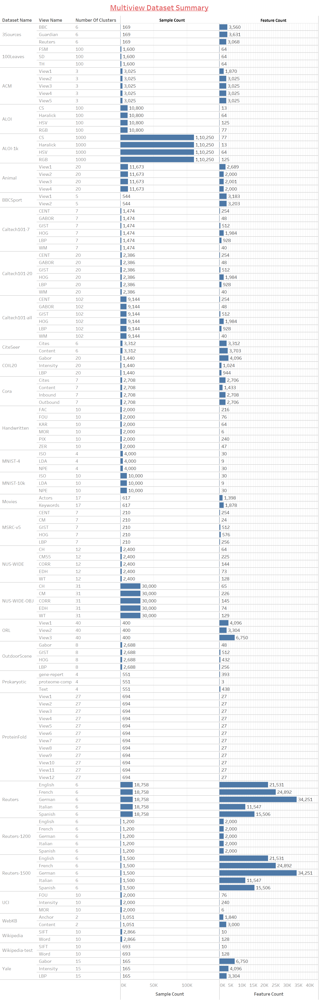

	This repository contains a comprehensive dataset for multi-view clustering, an advanced method used in machine learning and data analysis to group data points based on multiple perspectives or views. The dataset, provided in .mat format, comprises various types of data from different sources, allowing for the application of sophisticated clustering algorithms to uncover hidden patterns and relationships. Researchers and practitioners can leverage this dataset to develop, evaluate, and benchmark multi-view clustering techniques, driving innovation and improving the accuracy of data-driven insights.

## 1. Dataset Summary

## 2. Dataset Description

| Dataset Name   | sample_count | view_count | Clusters | Views (Feature Count)                                                                                                                                       | Description                                                                                                                                                                                                                                                                                                                                                                                                                                                                                                                                                         | Type        |
| -------------- | ------------ | ---------- | -------- | ----------------------------------------------------------------------------------------------------------------------------------------------------------- | ------------------------------------------------------------------------------------------------------------------------------------------------------------------------------------------------------------------------------------------------------------------------------------------------------------------------------------------------------------------------------------------------------------------------------------------------------------------------------------------------------------------------------------------------------------------- | ----------- |
| 100Leaves      | 1600         | 3          | 100      | SD(64) FSM(64) TH(64)                                                                                                                                | The 100Leaves Multiview dataset is a collection of leaf images from 100 different plant species. Each species has 16 samples, resulting in a total of 1600 images. The dataset includes various features such as shape descriptors, fine-scale margin, and texture histograms, which are provided in .mat format.                                                                                                                                                                                                                                                   | Image       |
| 3Sources       | 169          | 3          | 6        | Reuters(3068) BBC(3560) Guardian(3631)                                                                                                              | The 3Sources Multiview dataset is a multi-view text dataset collected from three well-known online news sources: BBC, Reuters, and The Guardian. This dataset includes 948 news articles covering 416 distinct news stories from February to April 20091. Each story is manually annotated with one or more of six topical labels: business, entertainment, health, politics, sport, and technology.                                                                                                                                                                | Text        |
| ACM            | 3025         | 5          | 3        | View1(1870) View2(3025) View3(3025) View4(3025) View5(3025)                                                                                     | The ACM Multiview dataset is a collection of papers published in prominent conferences such as KDD, SIGMOD, SIGCOMM, MobiCOMM, and VLDB. This dataset includes 3025 instances and is divided into three views: View1 (1870 features), View2 (3025 features), and View3 (3025 features).                                                                                                                                                                                                                                                                             |             |
| ALOI           | 10800        | 4          | 100      | CS(77) Haralick(13) HSV(64) RGB(125)                                                                                                               | A subset of ALOI-1k                                                                                                                                                                                                                                                                                                                                                                                                                                                                                                                                                 | Object      |
| ALOI-1k        | 110250       | 4          | 1000     | CS(77) Haralick(13) HSV(64) RGB(125)                                                                                                              | The ALOI-1k Multiview dataset is part of the Amsterdam Library of Object Images (ALOI), which is a collection of 110,250 images of 1,000 small objects. These images are taken under various light conditions and rotation angles, providing a rich set of data for multi-view clustering and other machine learning tasks. The dataset includes multiple feature sets such as color histograms (RGB, HSV), texture descriptors (Haralick features), and color similarity measures.                                                                                 | Object      |
| Animal         | 11673        | 4          | 20       | View1(2689) View2(2000) View3(2001) View4(2000)                                                                                                    | The Animal Multiview dataset is a selected set from the Animals with Attributes (AWA) dataset. It includes 11,673 instances across 20 classes. The dataset is divided into multiple views, with each view representing different feature sets such as color histograms, texture descriptors, and shape features.                                                                                                                                                                                                                                                    | Animal      |
| BBC4view       | 685          | 4          | 5        | View1(4659) View2(4633) View3(4665) View4(4684)                                                                                                    | The BBC4view Multiview dataset consists of 685 documents from the BBC Sport website, covering sports news. The dataset is divided into four views, with each view representing different feature sets such as term frequency-inverse document frequency (TF-IDF) and word embeddings.                                                                                                                                                                                                                                                                               | Text        |
| BBCSport       | 544          | 2          | 5        | View1(3183) View2(3203)                                                                                                                                  | The BBCSport Multiview dataset consists of 544 documents from the BBC Sport website, covering sports news from 2004 to 2005. The dataset is divided into multiple views, with each view representing different feature sets such as term frequency-inverse document frequency (TF-IDF) and word embeddings.                                                                                                                                                                                                                                                         | Text        |
| COIL20         | 1440         | 3          | 20       | Intensity(1024) LBP(944) Gabor(4096)                                                                                                                  | The COIL-20 Multiview dataset is a collection of 1,440 images of 20 objects. Each object is imaged at 72 different angles (5-degree intervals), providing a rich set of data for multi-view clustering and other machine learning tasks. The dataset includes multiple feature sets such as color histograms, texture descriptors, and shape features.                                                                                                                                                                                                              | Object      |
| Caltech101-20  | 2386         | 6          | 20       | GABOR(48) WM(40) CENT(254) HOG(1984) GIST(512) LBP(928)                                                                                      | The Caltech101-20 Multiview dataset consists of 2,386 images belonging to 20 classes. The dataset is divided into multiple views, with each view representing different feature sets such as Gabor features, wavelet moments (WM), CENTRIST features, histogram of oriented gradients (HOG), GIST features, and local binary patterns (LBP).                                                                                                                                                                                                                        | Object      |
| Caltech101-7   | 1474         | 6          | 7        | GABOR(48) WM(40) CENT(254) HOG(1984) GIST(512) LBP(928)                                                                                      | The Caltech101-7 Multiview dataset consists of 1,474 images belonging to seven classes: faces, motorbikes, dollar bills, Garfield, stop signs, and Windsor chairs. The dataset is divided into multiple views, with each view representing different feature sets such as Gabor features, wavelet moments (WM), CENTRIST features, histogram of oriented gradients (HOG), GIST features, and local binary patterns (LBP).                                                                                                                                           | Object      |
| Caltech101-all | 9144         | 6          | 102      | GABOR(48) WM(40) CENT(254) HOG(1984) GIST(512) LBP(928)                                                                                      | The Caltech101-all Multiview dataset consists of 9,144 images from 101 object categories. The dataset is divided into multiple views, with each view representing different feature sets such as Gabor features, wavelet moments (WM), CENTRIST features, histogram of oriented gradients (HOG), GIST features, and local binary patterns (LBP).                                                                                                                                                                                                                    | Object      |
| CiteSeer       | 3312         | 2          | 6        | Content(3703) Cites(3312)                                                                                                                                | The CiteSeer Multiview dataset consists of 3,312 scientific publications classified into one of six classes: Agents, AI, DB, IR, ML, and HCI. The dataset includes a citation network with 4,732 links. Each publication is described by a 0/1-valued word vector indicating the absence/presence of the corresponding word from the dictionary, which consists of 3,703 unique words.                                                                                                                                                                              | Text        |
| Cora           | 2708         | 4          | 7        | Content(1433) Inbound(2708) Outbound(2706) Cites(2706)                                                                                             | The Cora Multiview dataset consists of 2,708 scientific publications classified into one of seven classes. The dataset includes a citation network with 5,429 links. Each publication is described by a 0/1-valued word vector indicating the absence/presence of the corresponding word from the dictionary, which consists of 1,433 unique words.                                                                                                                                                                                                                 | Text        |
| Handwritten    | 2000         | 6          | 10       | FOU(76) FAC(216) KAR(64) PIX(240) ZER(47) MOR(6)                                                                                             | The Handwritten Multiview dataset consists of 2,000 handwritten digits from 0 to 9. Each digit is represented in six different views, including Fourier coefficients, pixel averages, and Zernike moments.                                                                                                                                                                                                                                                                                                                                                          | Image       |
| MNIST-10k      | 10000        | 3          | 10       | ISO(30) LDA(9) NPE(30)                                                                                                                                | The MNIST-10k Multiview dataset is a subset of the well-known MNIST dataset, consisting of 10,000 images of handwritten digits from 0 to 9. Each digit is represented in multiple views, such as different rotations, scales, and translations.                                                                                                                                                                                                                                                                                                                     | Handwritten |
| MNIST-4        | 4000         | 3          | 4        | ISO(30) LDA(9) NPE(30)                                                                                                                                | The MNIST-4 Multiview dataset is a variant of the well-known MNIST dataset, consisting of 70,000 images of handwritten digits distributed over ten classes.                                                                                                                                                                                                                                                                                                                                                                                                         | Handwritten |
| MSRC-v5        | 210          | 5          | 7        | CM(24) HOG(576) GIST(512) LBP(256) CENT(254)                                                                                                    | The MSRC-v5 Multiview dataset is a collection of 2,000 samples with six different views. This dataset is used to evaluate the performance of multi-view clustering algorithms. Each view represents different feature sets, making it an excellent resource for tasks like classification and clustering.                                                                                                                                                                                                                                                           | Image       |
| Movies         | 617          | 2          | 17       | Keywords(1878) Actors(1398)                                                                                                                              | The Movies Multiview dataset is a collection of movie-related data, including various features such as genres, ratings, and metadata.                                                                                                                                                                                                                                                                                                                                                                                                                               | Text        |
| NUS-WIDE       | 2400         | 5          | 12       | CH(64) CORR(144) EDH(73) WT(128) CM55(225)                                                                                                      | The NUS-WIDE Multiview dataset is a large-scale dataset containing 269,648 images with a total of 5,018 tags collected from Flickr. These images are manually annotated with 81 concepts, including objects and scenes.                                                                                                                                                                                                                                                                                                                                             | Object      |
| NUS-WIDE-OBJ   | 30000        | 5          | 31       | CH(65) CM(226) CORR(145) EDH(74) WT(129)                                                                                                        | The NUS-WIDE-OBJ Multiview dataset is a subset of the NUS-WIDE dataset, which contains 269,648 images with a total of 5,018 tags collected from Flickr. These images are manually annotated with 81 concepts, including objects and scenes.                                                                                                                                                                                                                                                                                                                         | Image       |
| ORL            | 400          | 3          | 40       | View1(4096) View2(3304) View3(6750)                                                                                                                   | The ORL Multiview dataset, also known as the Olivetti Research Laboratory (ORL) face dataset, consists of 400 grayscale images of 40 individuals. Each individual has 10 different images taken at different times, with varying lighting, facial expressions, and facial details.                                                                                                                                                                                                                                                                                  | Face        |
| OutdoorScene   | 2688         | 4          | 8        | GIST(512) HOG(432) LBP(256) Gabor(48)                                                                                                              | The OutdoorScene Multiview dataset, also known as the OMMO dataset, is a large-scale outdoor multi-modal dataset designed for novel view synthesis and implicit scene reconstruction. This dataset contains complex objects and scenes with calibrated images, point clouds, and prompt annotations. It includes a variety of real-world urban and natural scenes with different scales, camera trajectories, and lighting conditions, making it an excellent resource for evaluating and benchmarking NeRF-based methods and other multi-view learning algorithms. | Object      |
| Prokaryotic    | 551          | 3          | 4        | gene-repert(393) proteome-comp(3) Text(438)                                                                                                           | The Prokaryotic Multiview dataset is a collection of data related to prokaryotic organisms. This dataset includes multiple views representing different feature sets, making it ideal for tasks like classification and clustering.                                                                                                                                                                                                                                                                                                                                 | Genome      |
| ProteinFold    | 694          | 12         | 27       | View1(27) View2(27) View3(27) View4(27) View5(27) View6(27) View7(27) View8(27) View9(27) View10(27) View11(27) View12(27) | The ProteinFold Multiview dataset is designed for protein structure prediction and analysis. This dataset includes multiple views representing different feature sets such as amino acid sequences, secondary structure predictions, and evolutionary profiles.                                                                                                                                                                                                                                                                                                     | Protein     |
| Reuters        | 18758        | 5          | 6        | English(21531) French(24892) German (34251) Spanish (15506) Italian(11547)                                                                      | The Reuters Multiview dataset consists of 1,200 documents from the Reuters news collection. The dataset is divided into multiple views, with each view representing different feature sets such as term frequency-inverse document frequency (TF-IDF) and word embeddings.                                                                                                                                                                                                                                                                                          | Text        |
| Reuters-1200   | 1200         | 5          | 6        | English(2000) French(2000) German(2000) Spanish(2000) Italian(2000)                                                                             | The Reuters-1200 Multiview dataset consists of 1,200 documents from the Reuters news collection. The dataset is divided into multiple views, with each view representing different feature sets such as term frequency-inverse document frequency (TF-IDF) and word embeddings.                                                                                                                                                                                                                                                                                     | Text        |
| Reuters-1500   | 1500         | 5          | 6        | English(21531) French(24892) German(34251) Spanish(15506) Italian(11547)                                                                        | The Reuters-1500 Multiview dataset consists of 1,500 documents from the Reuters news collection. The dataset is divided into multiple views, with each view representing different feature sets such as term frequency-inverse document frequency (TF-IDF) and word embeddings.                                                                                                                                                                                                                                                                                     | Text        |
| UCI            | 2000         | 3          | 10       | Intensity(240) FOU(76) MOR(6)                                                                                                                         | The UCI Handwritten Multiview dataset consists of features of handwritten numerals (0-9) extracted from a collection of Dutch utility maps. It includes 2,000 patterns, with 200 patterns per class. Each pattern is digitized in binary images and described by multiple feature sets, making it ideal for tasks like classification and clustering.                                                                                                                                                                                                               | Handwritten |
| WebKB          | 1051         | 2          | 2        | Anchor(1840) Content(3000)                                                                                                                               | The WebKB Multiview dataset consists of 4,199 web pages from four universities: Cornell, Texas, Washington, and Wisconsin. The dataset is divided into multiple views, with each view representing different feature sets such as term frequency-inverse document frequency (TF-IDF) and word embeddings.                                                                                                                                                                                                                                                           | Text        |
| Wikipedia      | 2866         | 2          | 10       | Word(128) SIFT(10)                                                                                                                                       | The Wikipedia Multiview dataset consists of 2,865 documents from the Wikipedia website. The dataset is divided into multiple views, with each view representing different feature sets such as term frequency-inverse document frequency (TF-IDF) and word embeddings.                                                                                                                                                                                                                                                                                              | Text        |
| Wikipedia-test | 693          | 2          | 10       | Word(128) SIFT(10)                                                                                                                                       | The Wikipedia-test Multiview dataset consists of 2,865 documents from the Wikipedia website. The dataset is divided into multiple views, with each view representing different feature sets such as term frequency-inverse document frequency (TF-IDF) and word embeddings.                                                                                                                                                                                                                                                                                         | Text        |
| Yale           | 165          | 3          | 15       | Intensity(4096) LBP(3304) Gabor(6750)                                                                                                                 | The Yale Multiview dataset, also known as the Yale Face Database, consists of 165 grayscale images of 15 individuals. Each individual has 11 different images taken under varying lighting conditions, facial expressions, and facial details.                                                                                                                                                                                                                                                                                                                      | Face        |                                                                                                                                                               | Face        |